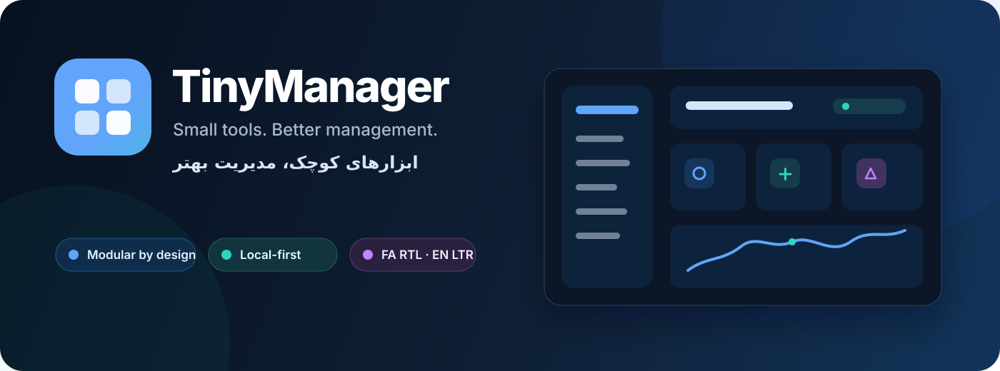

<p align="center">
  
</p>

<p align="center">
  <strong>A lightweight, modular, local-first bilingual manager workspace with the Tiny Language Engine</strong>
</p>

<p align="center">
  <a href="README.md">🇮🇷 فارسی</a> · <a href="README.en.md">🇬🇧 English</a>
</p>

<p align="center">
  
  
  
  
  
  
</p>

# TinyManager

**TinyManager** is not another oversized ERP or project-management suite. It is a focused **manager workspace with a small shared core and installable modules**. Managers activate only the tools they need and can use short commands instead of hunting through menus and long forms.

> **Product principle:** TinyManager should grow with the manager, not overwhelm the manager.

## Current status

The core is now executable and includes:

- bilingual Persian/English App Shell;
- native RTL/LTR mirroring;
- Light / Dark / System themes;
- Module Registry and Module Manager;
- IndexedDB-backed shared Storage API;
- full Core + module Backup / Restore;
- shared Project and early Shared People entities;
- Webtanan Jalali Date Engine for Persian dates;
- Tiny AI powered by the **Tiny Language Engine (TLE)** with no external LLM dependency;
- confirmed runtime vocabulary teaching;
- inline supervised learning for unknown phrases;
- local Training History for future suggestion ranking.

### Executable modules

| Module | Status | Purpose |
|---|---|---|
| `tiny-decision-matrix` | Alpha | Rank options using weighted criteria |
| `tiny-meeting-cost` | Alpha | Calculate meeting cost and person-hours |
| `tiny-waiting` | Alpha | Track items that are waiting on another person |

RACI, Risk, Delegation, Deadline, Weekly Review and Project Health already have independent repositories and shared foundation contracts and will be integrated progressively.

## Tiny AI without a general-purpose LLM

TinyManager does not embed a general-purpose model such as ChatGPT for its core command flow. Its local engine is the **Tiny Language Engine — TLE**.

TLE recognizes only defined bilingual concepts, aliases and patterns. Free values such as project names, people, amounts and notes are extracted into slots.

Example:

```text
Create project Factory Line 3 with budget 500000 USD
```

Controlled concepts:

```text
project → entity.project
budget → field.budget
create → action.create
```

Free values:

```text
Factory Line 3
500000 USD
```

### Missing information

If a manager writes:

```text
Create project Expo
```

Tiny AI does not open a long project form. It asks only for the missing required value.

### Unknown phrase → inline learning

Suppose a manager writes:

```text
project warehouse with budget 200000 launch
```

and `launch` is not defined yet. Tiny AI does not guess. It opens a small learning card in the same command surface:

```text
New phrase: launch

Which TinyManager concept does this mean?
[ choose from current system concepts ]
```

If the known sentence context is strong enough, TLE may show a **non-binding suggestion**, such as `create`. The manager still chooses and confirms.

After confirmation, the alias is stored under:

```text
core.language.aliases.v1
```

and the confirmed learning context is stored under:

```text
core.language.training.v1
```

Both remain local and are included in TinyManager backup/restore.

See [`docs/TINY_LANGUAGE_ENGINE.md`](docs/TINY_LANGUAGE_ENGINE.md).

## Why TinyManager?

Managers need quick answers to questions such as:

- What needs my attention today?
- Who am I waiting on?
- What have I delegated, and to whom?
- Which deadlines are approaching or overdue?
- Which risks matter most?
- Which decision needs to be made?
- How healthy are my projects?

TinyManager separates these concerns into small modules while keeping shared data and user experience inside one core.

## Modules

| Module | Repository | Purpose |
|---|---|---|
| Decision Matrix | `tiny-decision-matrix` | Compare options using weighted criteria |
| Meeting Cost | `tiny-meeting-cost` | Calculate the real cost of a meeting |
| RACI | `tiny-raci` | Map Responsible / Accountable / Consulted / Informed |
| Risk | `tiny-risk` | Track risks and probability × impact heatmaps |
| Waiting For | `tiny-waiting` | Track items waiting on other people |
| Delegation | `tiny-delegation` | Follow delegated work |
| Deadline | `tiny-deadline` | See upcoming and overdue deadlines |
| Weekly Review | `tiny-weekly-review` | Run a structured manager weekly review |
| Project Health | `tiny-project-health` | Produce a quick project health signal |

Each module is designed for two modes:

1. **Standalone** — usable as an independent micro app.
2. **TinyManager Module** — installable inside TinyManager without duplicating domain logic.

## Bilingual at the core

Persian is the first language and English is the second. Localization is architectural, not a late translation layer.

### Persian mode

- Full RTL interface
- Sidebar on the right
- Jalali dates powered by Webtanan Jalali Date Engine
- Direction-aware controls and navigation

### English mode

- Full LTR interface
- Sidebar on the left
- Gregorian presentation
- English labels and Latin digits

Switching locale mirrors the entire interface direction as well as translating copy.

## Technology stack

- **TypeScript**
- **React**
- **Vite**
- **Tailwind CSS + CSS Variables**
- **Lucide Icons**
- **IndexedDB**
- **Webtanan Jalali Date Engine**
- **Vitest**

## Architecture

```text
TinyManager Core
│
├── App Shell
├── Dashboard
├── Tiny AI / TLE
│   ├── Controlled vocabulary
│   ├── Intent patterns
│   ├── Slot extraction
│   ├── Inline learning
│   └── Suggestion layer
├── i18n + RTL/LTR
├── Module Registry
├── Storage API
├── Date API
├── Theme
├── Backup / Restore
└── Shared Entities
     ├── People
     ├── Projects
     ├── Teams
     └── Tags

Modules
├── Decision Matrix
├── Meeting Cost
├── RACI
├── Risk
├── Waiting For
├── Delegation
├── Deadline
├── Weekly Review
└── Project Health
```

See [`docs/MODULE_SPEC.md`](docs/MODULE_SPEC.md).

## Local-first and privacy

The base edition works without an account or server.

- Primary data stays on the user's device.
- TLE requires no internet connection, API key or external model.
- Modules use the Core Storage API rather than talking directly to a database.
- Backups include Core data, module data and learned vocabulary.
- A future Cloud Sync adapter can be added without rewriting module domain logic.

## Development

```bash
git clone https://github.com/webtanan-sketch/tinymanager.git
cd tinymanager
npm install
npm run dev
```

Quality checks:

```bash
npm run typecheck
npm run test
npm run build
```

## Design principles

1. One problem, one module.
2. Minimize manager input.
3. Ask one question at a time.
4. Prefer progressive disclosure over configuration walls.
5. First-class Persian and RTL.
6. Local-first by default.
7. No mutation without preview and confirmation.
8. One shared design system across repositories.
9. Every module remains useful outside the Core.
10. Suggestions may become smarter while execution remains controlled.

## Documentation

- [`ARCHITECTURE.md`](docs/ARCHITECTURE.md)
- [`MODULE_SPEC.md`](docs/MODULE_SPEC.md)
- [`DESIGN_SYSTEM.md`](docs/DESIGN_SYSTEM.md)
- [`UX_PRINCIPLES.md`](docs/UX_PRINCIPLES.md)
- [`TINY_LANGUAGE_ENGINE.md`](docs/TINY_LANGUAGE_ENGINE.md)

## Roadmap

- [x] TypeScript + React + Vite foundation
- [x] Bilingual RTL/LTR App Shell
- [x] Module Registry
- [x] IndexedDB Storage API
- [x] Jalali date service
- [x] Backup / Restore
- [x] Offline Tiny Language Engine
- [x] Runtime vocabulary teaching
- [x] Inline learning for unknown phrases
- [x] Decision Matrix reference module
- [x] Meeting Cost module
- [x] Waiting For module
- [ ] Shared People integration across all modules
- [ ] Delegation module
- [ ] Deadline module + natural date phrases
- [ ] Risk module
- [ ] RACI module
- [ ] Weekly Review auto-aggregation
- [ ] Project Health scoring
- [ ] Dashboard widgets
- [ ] PWA Offline Mode
- [ ] First public Alpha release

## License

MIT © 2026 Webtanan